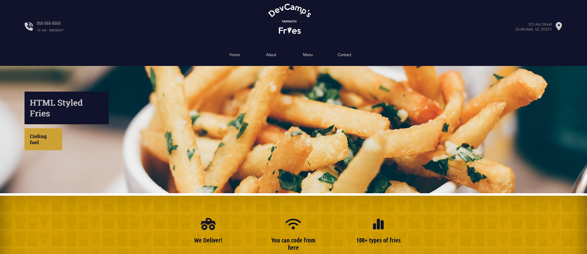

## FantasticFries

**FantasticFries** Website for a fictional restaurant called FantasticFries created with [Astro](https://astro.build/). The website features a modern and attractive design, with sections for the" Menu", "Contact" information, and an "About Us" page.


## Features

- **Menu:** A list of the different types of french fries offered by the restaurant.
- **Contact:** A contact form for customers to send their questions and comments.
- **About Us:** Information about the restaurant's history and mission.

## How to run the project

1. **Install dependencies:**

```bash
npm install
```

2. **Start the development server:**

```bash
npm run dev
```

3. **Open in your browser:**

Open your browser and go to [http://localhost:4321](http://localhost:4321) to see the website in action.

[DeepWiki moraisLuismNet/FantasticFries](https://deepwiki.com/moraisLuismNet/FantasticFries)

